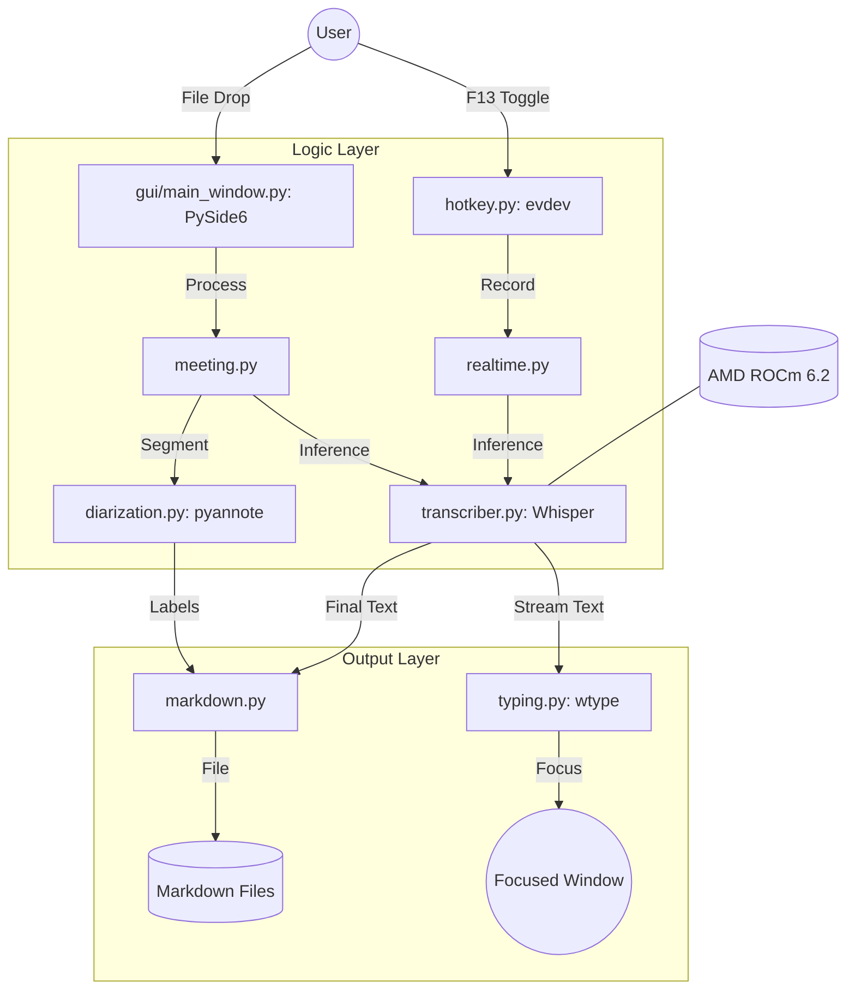

# Technical Specification: Real-time Speech-to-Text Tool (Whisper STT)

## 1. Project Overview
This project aims to develop a high-performance, low-latency speech-to-text (STT) utility optimized for AMD hardware (ROCm) on Linux. The tool is designed to provide seamless voice-to-text integration for daily workflows (Push-to-Talk) and comprehensive transcription for recorded audio files (Meeting Mode).

### Target Environment
- **Hardware**: AMD Radeon RX 7800XT (gfx1101, RDNA3)
- **Platform**: Arch Linux
- **Display Server**: Wayland (Hyprland compositor)
- **Acceleration**: ROCm 6.2+ with PyTorch

---

## 2. Functional Requirements

### 2.1 Mode 1: Real-time Push-to-Talk (PTT)
Designed for hands-free typing in terminal-heavy workflows.
- **Trigger**: Global hotkey toggle using `F13` (KEY_F13, scancode 183).
- **Execution**: 
    1. Press `F13` to start recording.
    2. Real-time transcription using Whisper `large-v3-turbo`.
    3. Direct text injection into the currently focused window.
    4. Press `F13` again to stop recording and finalize transcription.
- **Visual Feedback**: 
    - Integration with Waybar via a custom signal or JSON module.
    - Optional desktop notifications via `libnotify` (e.g., `dunst` or `mako`).

### 2.2 Mode 2: Audio File Transcription (Meeting Mode)
Designed for processing pre-recorded audio with high accuracy and speaker identification.
- **Input**: Graphical User Interface (GUI) supporting drag-and-drop or file selection for standard formats (`mp3`, `wav`, `m4a`, `flac`).
- **Features**:
    - **Speaker Diarization**: Identification and labeling of different speakers (e.g., "Speaker 1", "Speaker 2").
    - **Timestamps**: Inserted at speaker transitions or roughly every 30 seconds.
    - **Progress Tracking**: Real-time progress bar indicating transcription status.
    - **Preview**: Built-in viewer for the generated transcription.
- **Output**: Auto-named Markdown file derived from content context (e.g., "Q4_Planning_Discussion.md").

---

## 3. Technical Requirements

### 3.1 Hardware Acceleration
- **Backend**: PyTorch with ROCm 6.2+ support.
- **Optimization**: Specifically targeting RDNA3 architecture (gfx1101).
- **VRAM Management**: Primary model is `large-v3-turbo` (~6GB VRAM). Automatic fallback to `medium` if insufficient VRAM is detected.

### 3.2 Core Dependencies
- **Transcription**: `openai-whisper` (chosen over `faster-whisper` for native ROCm compatibility and stability).
- **Diarization**: `pyannote-audio` (pretrained models for speaker segmentation).
- **Input Capture**: `python-evdev` for low-level keyboard access (requires `input` group membership).
- **Text Injection**: `wtype` for Wayland-native virtual keyboard input.
- **GUI Framework**: `PySide6` (Qt6) for robust Wayland support and high-DPI scaling.

---

## 4. System Architecture



---

## 5. Software Structure

```text
whisper-stt/
├── pyproject.toml              # Build system requirements
├── README.md                   # User documentation
├── src/
│   └── whisper_stt/
│       ├── __init__.py
│       ├── cli.py              # CLI Entry point & argument parsing
│       ├── realtime.py         # Real-time audio stream management
│       ├── hotkey.py           # python-evdev listener for F13
│       ├── typing.py           # wtype integration for text injection
│       ├── transcriber.py      # OpenAI Whisper engine wrapper
│       ├── diarization.py      # pyannote-audio speaker detection
│       ├── meeting.py          # Batch processing & meeting logic
│       ├── markdown.py         # Markdown output formatting logic
│       ├── title_generator.py  # Content-based file naming (NLP)
│       └── gui/
│           ├── __init__.py
│           ├── main_window.py  # Qt6 Main Window & event loop
│           ├── file_picker.py  # Drag-and-drop implementation
│           └── progress.py     # Progress bar & status components
└── tests/                      # Unit and integration tests
```

---

## 6. Implementation Plan

### 6.1 Installation Steps
1. **System Packages**: Install `wtype` and `python-pip` via `pacman`.
2. **Permissions**: Add the user to the `input` group to allow `evdev` to read keyboard events.
   ```bash
   sudo usermod -aG input $USER
   ```
3. **Environment**: Install PyTorch with ROCm 6.2 indices.
   ```bash
   pip install torch torchaudio --index-url https://download.pytorch.org/whl/rocm6.2
   ```
4. **Development**: Install the package in editable mode.
   ```bash
   pip install -e .
   ```

### 6.2 CLI Usage
- `stt`: Start the background daemon for Push-to-Talk mode.
- `stt --gui`: Launch the Meeting Mode graphical interface.
- `stt <path_to_file>`: Directly transcribe a specific file.
- `stt --batch <directory>/*.mp3`: Batch process multiple files.

---

## 7. Success Criteria
- **Latency**: Push-to-Talk activation and transcription delay <100ms for initial response.
- **Accuracy**: WER (Word Error Rate) aligns with Whisper `large-v3-turbo` benchmarks (~7.75% for English).
- **Diarization**: Correctly identifies speaker changes in multi-speaker audio with minimal overlap errors.
- **Performance**: Confirmed GPU utilization on RX 7800XT via `rocm-smi` during active transcription.
- **Stability**: Responsive GUI that does not hang during long-running batch processes.

---

## 8. Constraints & Out of Scope
- **Offline Only**: No cloud-based STT APIs (privacy and latency focus).
- **Display**: Wayland only (specifically Hyprland/wlroots). X11 support is not required.
- **Vendor**: AMD ROCm optimization only. NVIDIA (CUDA) and Intel (OneAPI) are out of scope.
- **Features**: Post-transcription LLM summarization is reserved for future versions.
